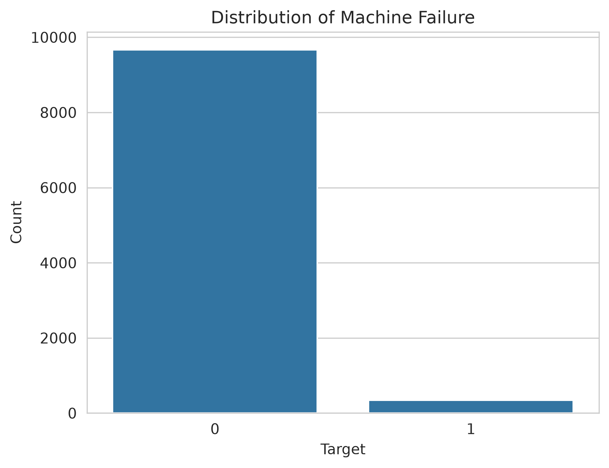
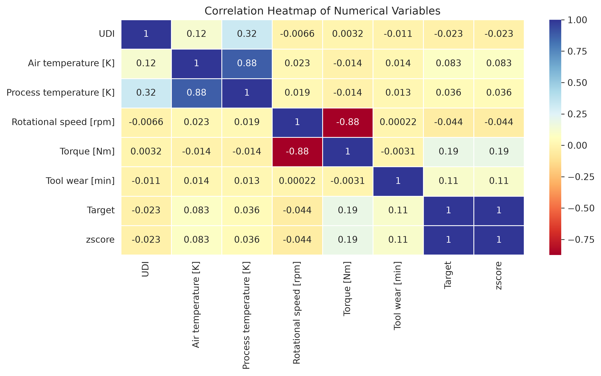
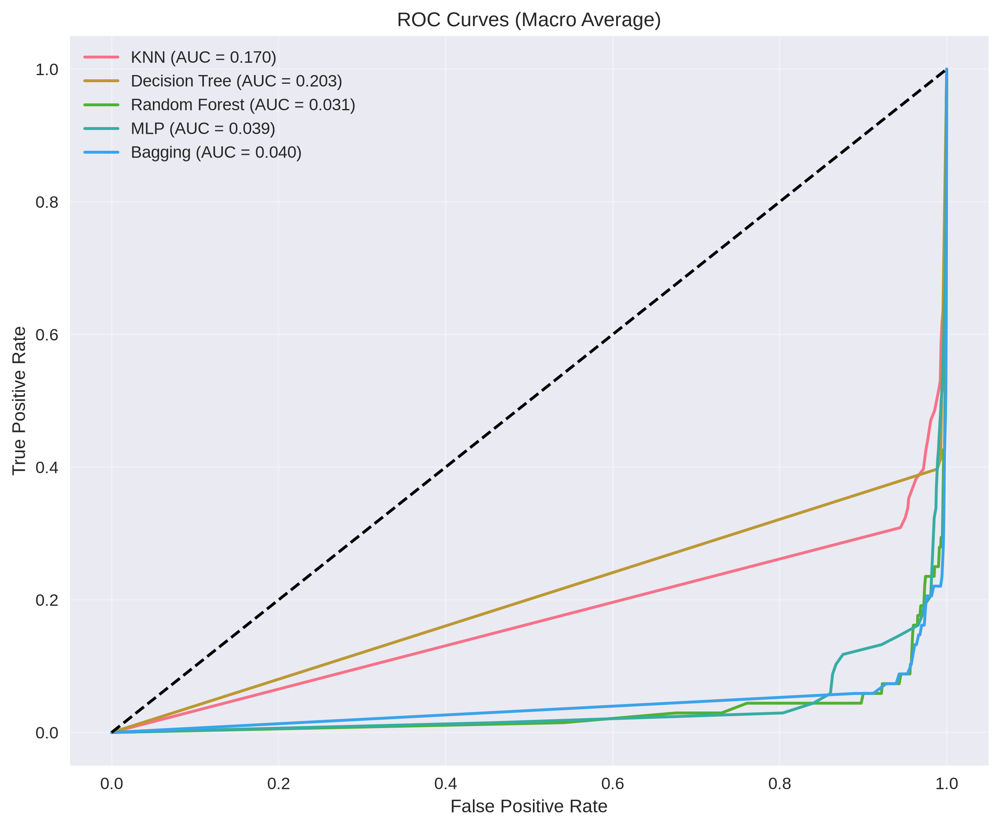
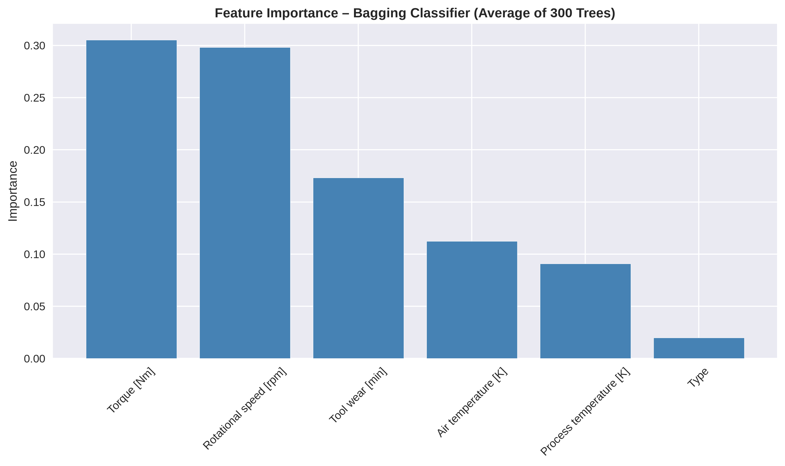

# Predictive Maintenance Classification


An end-to-end machine learning classification for detecting industrial machine failures and classifying their likely failure mode from operating-condition and sensor data.

It combines exploratory data analysis, preprocessing, imbalance-conscious modeling, explainability visualizations, cross-validation, and serialized model artifacts in one reproducible Jupyter workflow.

> **Portfolio focus:** This project demonstrates practical tabular machine learning for an industrial use case, with particular attention to rare-event evaluation. It is a classification study, not a production deployment or remaining-useful-life system.

## Results at a glance

| Measure | Reported result |
| --- | --- |
| Dataset | 10,000 synthetic industrial observations |
| Prediction tasks | Binary failure detection and multi-class failure-type classification |
| Failure types | Tool wear, heat dissipation, power, overstrain, and random failure |
| Validation strategy | Stratified 80/20 split and 10-fold stratified cross-validation |
| Binary result | Random Forest: **0.98 accuracy**, **0.72 failure recall** |
| Multi-class result | Random Forest: **0.8565 10-fold macro F1** |
| Reported macro ROC-AUC | **0.988** in the notebook's multi-class ROC figure |

The reported metrics come from the executed notebook workflow. Macro F1 is emphasized because ordinary accuracy can be misleading when normal operation substantially outnumbers failures. The notebook also contains a narrative selection of Bagging as the best model, while its printed 10-fold table ranks Random Forest first by macro F1; both details are preserved transparently below.

## Why this project matters

Unexpected equipment failure can create downtime, production bottlenecks, quality issues, and emergency maintenance costs. A useful predictive-maintenance workflow must therefore do more than maximize accuracy on the majority class: it should preserve rare failure examples, expose the trade-offs between false alarms and missed failures, and provide outputs that maintenance and engineering teams can investigate.

This project addresses those requirements by:

- inspecting the data before modeling through univariate and multivariate EDA;
- detecting extreme observations with z-scores and Isolation Forest;
- reducing the influence of extreme sensor values with conservative Winsorization;
- removing identifier-like fields that do not represent machine behavior;
- representing failure modes as explicit model features and multi-class labels;
- comparing interpretable and non-linear model families;
- evaluating models with confusion matrices, classification reports, macro F1, and macro ROC curves;
- saving trained estimators and supporting visual artifacts for inspection and reuse.

## Workflow

```text
AI4I 2020 sensor data
        |
        v
Data quality checks and exploratory analysis
        |
        v
Outlier analysis -> conservative Winsorization
        |
        v
Identifier removal + categorical encoding + feature preparation
        |
        v
Stratified train/test split and imbalance-aware training
        |
        v
KNN | Decision Tree | Random Forest | MLP | Bagging
        |
        v
Confusion matrices + classification reports + macro F1 + ROC/AUC
        |
        v
Serialized model artifacts and feature-importance visualizations
```

## Dataset and source

The project uses the [AI4I 2020 Predictive Maintenance Dataset](https://archive.ics.uci.edu/dataset/601/ai4i+2020+predictive+maintenance+dataset), originally published through the [UCI Machine Learning Repository](https://archive.ics.uci.edu/). The local copy is stored at [`dataset/ai4i2020.csv`](dataset/ai4i2020.csv).

The dataset contains:

- product type (`L`, `M`, `H`);
- air temperature and process temperature, measured in Kelvin;
- rotational speed, measured in revolutions per minute;
- torque, measured in Newton-metres;
- tool wear, measured in minutes;
- a binary `Target` indicating machine failure;
- a `Failure Type` label describing the observed failure mode. Its six classes are:
        - `No Failure`;
        - `Tool Wear Failure`;
        - `Heat Dissipation Failure`;
        - `Power Failure`;
        - `Overstrain Failure`;
        - `Random Failures`.

The notebook identifies strong class imbalance: 9,661 normal-operation observations (`Target = 0`, 96.61%) and 339 failure observations (`Target = 1`, 3.39%). The rarest category is `Random Failures`, with 18 observations. `UDI` and `Product ID` are treated as identifiers rather than predictive operating variables.

### Exploratory data analysis (EDA)

The EDA stage establishes data quality, class structure, feature behavior, and relationships before modeling:

- **Data quality:** inspected dimensions, data types, descriptive statistics, missing values, and duplicate rows. The dataset has 10,000 rows, 10 columns, no missing values, and no duplicate rows.
- **Target and category distributions:** used count plots, bar charts, and pie charts to show the severe normal-versus-failure imbalance and the distribution of machine types and failure modes.
- **Numerical feature distributions:** used histograms, density views, and box plots for air temperature, process temperature, rotational speed, torque, tool wear, `UDI`, and `Target`.
- **Feature relationships:** used a correlation heatmap, a target-colored pair plot, and a bubble chart relating rotational speed, torque, tool wear, machine type, and failure status.
- **Outlier investigation:** compared z-score distributions with multivariate Isolation Forest results. Extreme values were concentrated mainly around rotational speed, torque, and tool wear, which informed the later Winsorization step.

The generated EDA figures are available in [`assets/`](assets/), including [`assets/machine_failure_distribution.png`](assets/machine_failure_distribution.png), [`assets/correlation_heatmap.png`](assets/correlation_heatmap.png), [`assets/pairplot_numerical_features_target.png`](assets/pairplot_numerical_features_target.png), and [`assets/isolation_forest_outlier_detection.png`](assets/isolation_forest_outlier_detection.png).

### Preprocessing

1. Inspect shape, data types, missing values, duplicates, distributions, and correlations.
2. Use Isolation Forest and z-score visualizations to investigate anomalous observations.
3. Apply conservative Winsorization to rotational speed, torque, and tool wear while retaining failure rows.
4. Encode `Type` as an ordered category and expand failure modes into binary indicators for the multi-class workflow.
5. Exclude identifiers and target-derived columns from the final feature matrix.
6. Use stratification for the binary train/test split and cross-validation to preserve rare classes.

## Modeling Approch

### Binary and multi-class classification

The notebook treats the problem as two related supervised-learning tasks:

#### 1. Binary classification: will the machine fail?

- **Target:** `Target`, where `0` means no failure and `1` means failure.
- **Features:** machine type, air temperature, process temperature, rotational speed, torque, and tool wear.
- **Excluded fields:** `UDI`, `Product ID`, `Failure Type`, and failure-type indicator columns, preventing the failure-mode labels from directly entering the binary model.
- **Evaluation:** stratified 80/20 train/test split, classification report, and confusion matrix.
- **Reported Random Forest result:** `0.86` accuracy, `0.77` macro F1, and `0.72` recall for the failure class. The test confusion matrix contains 49 correctly detected failures, 19 missed failures, 15 false alarms, and 1,917 correctly identified normal cases.

This framing is useful when the maintenance decision is simply whether an intervention or inspection should be triggered.

#### 2. Multi-class classification: what type of failure is likely?

- **Target:** six classes: `No Failure`, `Tool Wear Failure`, `Heat Dissipation Failure`, `Power Failure`, `Overstrain Failure`, and `Random Failure`.
- **Feature construction:** the original failure-type field is converted into one-hot indicators (`TWF`, `HDF`, `PWF`, `OSF`, and `RNF`) for analysis, then those target-derived indicators are removed from the final model feature matrix. This keeps the model focused on operating measurements when predicting failure type.
- **Models compared:** KNN, Decision Tree, Random Forest, MLP, and Bagging.
- **Evaluation:** 10-fold stratified cross-validation using macro F1, plus multi-class confusion matrices, classification reports, and macro-averaged ROC curves.

The executed cross-validation table reports:

| Model | 10-fold macro F1 |
| --- | ---: |
| Random Forest | **0.8565** |
| MLP | 0.8516 |
| Bagging | 0.8481 |
| Decision Tree | 0.7941 |
| KNN | 0.7431 |

The notebook's ROC visualization reports a macro ROC-AUC of **0.988** for the highlighted best-performing curve. Because the notebook's prose labels Bagging as the best model while the printed cross-validation table ranks Random Forest first by macro F1, the results should be read with that evaluation inconsistency in mind. For model selection, the printed cross-validation table is the more direct evidence.

### Models compared

| Model | Role in the study | Saved artifact |
| --- | --- | --- |
| K-Nearest Neighbors | Non-parametric distance-based baseline | [`models/knn_model.joblib`](models/knn_model.joblib) |
| Decision Tree | Interpretable rule-based model | [`models/decision_tree_model.joblib`](models/decision_tree_model.joblib) |
| Random Forest | Feature-randomized tree ensemble with class balancing | [`models/random_forest_model.joblib`](models/random_forest_model.joblib) |
| MLP Classifier | Non-linear neural-network comparison | [`models/mlp_model.joblib`](models/mlp_model.joblib) |
| Bagging Classifier | Selected ensemble using balanced decision-tree estimators | [`models/bagging_model.joblib`](models/bagging_model.joblib) |

Feature importance is calculated from the Bagging ensemble to make its predictions easier to inspect. The serialized artifacts preserve the trained comparisons; the cross-validation table above provides the clearest ranking by macro F1.

## Visual analysis

The repository includes generated figures covering data quality, distributions, relationships, outliers, model diagnostics, and interpretability. A few representative outputs are shown below.

### Failure distribution



### Correlation analysis



### Model comparison



### Ensemble interpretability



Additional plots are available in [`assets/`](assets/), including pair plots, missing-value checks, Isolation Forest results, preprocessing comparisons, confusion matrices, and decision-tree visualizations.

## Reproduce the analysis

### 1. Clone the repository

```bash
git clone https://github.com/Birhanegeb/AI-Predictive.git
cd AI-Predictive
```

### 2. Create and activate a virtual environment

```bash
python -m venv venv
source venv/bin/activate
```

On Windows, activate with:

```powershell
venv\Scripts\activate
```

### 3. Install dependencies

```bash
pip install -r requirements.txt
```

### 4. Run the notebook

```bash
jupyter notebook Predictive_maintenance.ipynb
```

Run the notebook from top to bottom. The workflow creates or refreshes generated files in `assets/` and `models/`. Because later cells depend on dataframes created earlier, restarting the kernel and selecting **Run All** is the most reliable execution path.

## Repository structure

```text
.
├── Predictive_maintenance.ipynb     # Complete EDA, preprocessing, modeling, and evaluation
├── dataset/
│   └── ai4i2020.csv                 # Input dataset
├── assets/                           # EDA, evaluation, and explainability figures
├── models/                           # Serialized estimators and model plots
├── requirements.txt                  # Python dependencies
├── settings.json                     # Workspace interpreter configuration
├── README.md                         # Project Documentation
```

## Engineering takeaways

- **Metric choice matters:** macro F1 gives rare failure types a meaningful voice instead of allowing the majority class to dominate the headline score.
- **Outliers require domain judgment:** clipping extreme values preserves scarce failure observations better than deleting them outright.
- **Model comparison should be purposeful:** KNN, tree models, ensembles, and an MLP provide different trade-offs between interpretability, non-linearity, and robustness.
- **Explainability supports adoption:** confusion matrices, shallow tree diagrams, and ensemble feature importance make model behavior easier to discuss with non-ML stakeholders.
- **Reproducibility is part of the deliverable:** dependencies, a single executable notebook, saved figures, and serialized models are included in the repository.

## Limitations and next steps

This repository uses a synthetic, static tabular dataset. It does not include machine histories, timestamps, maintenance interventions, costs, or true time-to-failure labels. The resulting models should therefore be interpreted as failure classification examples rather than production prognostics.

For a production-grade extension, the next steps would be:

- fit preprocessing and feature transformations inside an explicit scikit-learn `Pipeline`;
- add leakage-focused validation using time-ordered machine histories;
- tune decision thresholds against maintenance costs and service-level objectives;
- calibrate probabilities and monitor drift after deployment;
- validate on real operational data and document data, model, and fairness governance;
- expose the selected model through a tested inference API or monitoring application.

## Author

**Birhane** — MSc Data Engineering student

This project is part of a portfolio demonstrating applied data analysis, machine learning, model evaluation, and industrial problem framing.